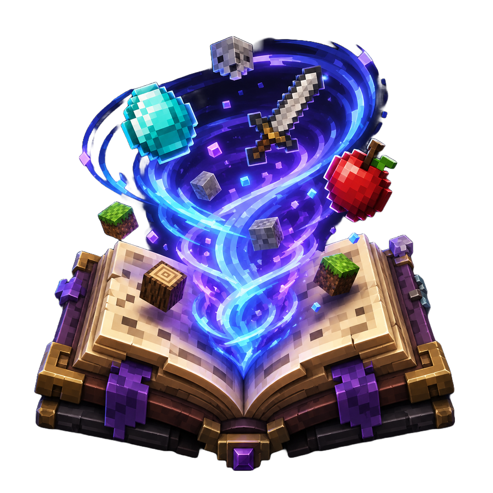
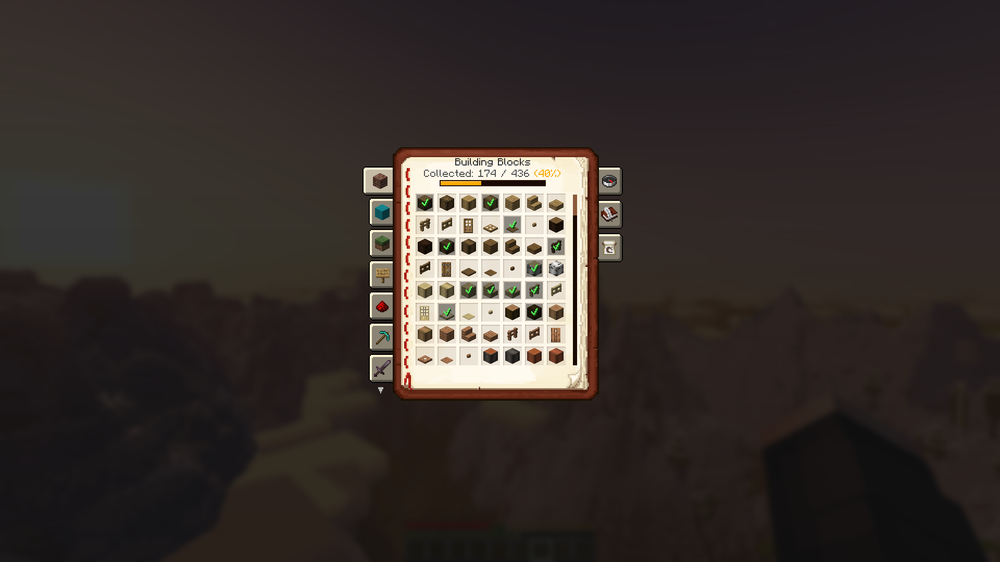
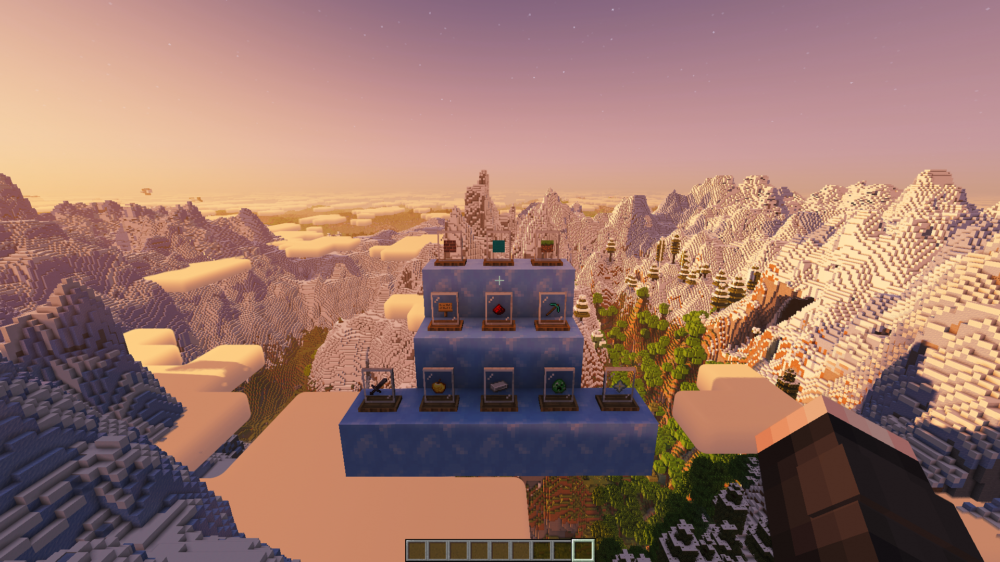
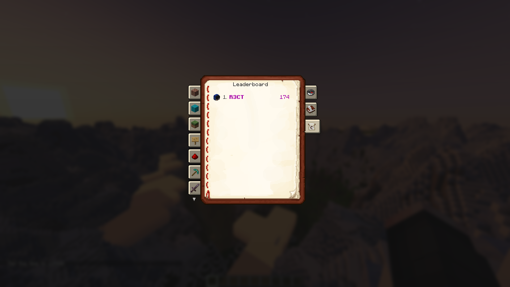
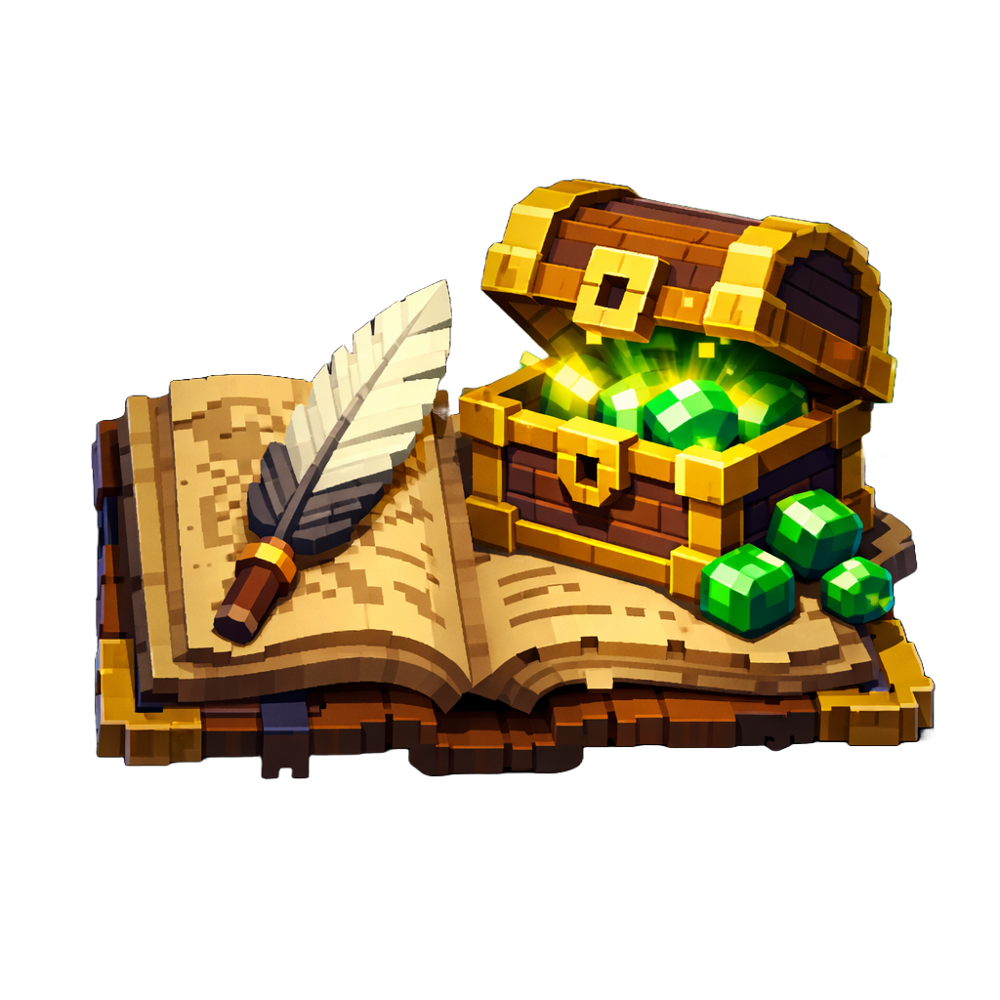

# R3CT Collection 📖✨

The ultimate completionist and collection mod for Minecraft!
R3CT Collection automatically scans all items in your game (including those from other mods) and generates a beautifully categorized interactive Catalog. Gather items, earn XP, claim milestone rewards, and compete with other players on your server! Built for both Fabric and NeoForge!

  

---

## ✨ Features

* **📖 Dynamic Catalog System:** * The mod automatically scans Creative Tabs to generate categories. It adapts perfectly to any modpack, no matter how big!
  * Submit items you find in the world to unlock them in your personal Catalog.
  * Check your progress with visually pleasing progress bars and dynamic percentage colors.

  

* **🎁 Progression & Rewards:** * Earn Experience Points for every unique item you submit! The XP amount scales with the item's vanilla rarity (Common, Uncommon, Rare, Epic).
  * **Milestone Loot:** Receive random configurable loot boxes every X items you collect.
  * **100% Completion:** Finish an entire category to receive a special reward!

  

* **🏆 Integrated Server Leaderboard:** * Compete with your friends! The Catalog features a built-in "Top 10" Leaderboard.
  * Hover over a player's head in the leaderboard to inspect their exact completion percentage for every category.

  

* **🔄 Cross-Platform:** * Fully native support and identical features for both **Fabric** and **NeoForge**.

---

## 🔌 Dependencies & Requirements

To run this mod, you will need to install a few library mods depending on your loader:

**For Fabric:**
* [Fabric API](https://modrinth.com/mod/fabric-api) (Required)
* [Mod Menu](https://modrinth.com/mod/modmenu) (Optional - to access in-game client settings)

**For NeoForge:**
* Nothing!

---

## 📖 Documentation

For detailed guides on how to configure blacklists, adjust rewards, and tweak the mod's mechanics, visit our official Wiki:
👉 **[View the Wiki](https://github.com/R3CTrc/R3CT-Collection/wiki)**

<b>Click to see popular topics 💡</b>

* [📥 Getting Started](https://github.com/R3CTrc/R3CT-Collection/wiki/Getting-Started)
* [⚙️ Configuring Blacklists](https://github.com/R3CTrc/R3CT-Collection/wiki/Blacklists-Setup)
* [💎 Customizing Rewards & XP](https://github.com/R3CTrc/R3CT-Collection/wiki/Rewards-Configuration)

---

## ⚙️ Configuration & Customization

The mod is highly customizable! There are two ways to configure it:

### 1. In-Game Settings (Client-side)
Players can access the mod settings via **Mod Menu** (on Fabric) or the **Mods tab** (on NeoForge). Here, users can:
* Adjust the GUI scale of the Catalog Book to perfectly fit their screen resolution.

### 2. File Configuration (Server-side / Modpack Creators)
All core mechanics, loot pools, and blacklists can be completely rewritten. After running the mod once, navigate to the `config/r3ct_collection/` folder:

* **`r3ct_collection_items.json`** - Manage blacklists. Exclude specific mods, creative tabs, or individual items from being scanned.
* **`r3ct_collection_rewards.json`** - Tweak the XP granted for item rarities, customize the milestone intervals, and set up specific loot pools and category completion rewards.
* **`r3ct_collection_client.json`** - Client-side settings (GUI Scale).

*Note: The mod features an auto-migration system. If the config format updates in future versions, your old config will be safely backed up!*

---

## 📥 Installation

1. Download the latest release from the **Versions** tab.
2. Download the required dependencies listed above for your specific mod loader.
3. Place all `.jar` files into your Minecraft `mods` folder.
4. Press `K` (default keybind) in-game to open your Catalog and start collecting!

---

## 📦 Check out my other mods!

If you enjoy this mod, you might also like my other projects:

### [🎯 R3CT Daily Quests & Rewards](https://modrinth.com/mod/r3ct-daily-quests-rewards)
*A highly configurable Daily Quests & Rewards mod! Keep players engaged with dynamic tasks, login rewards, streaks, and competitive leaderboards.*

---

## 💖 Support the Development

I'm a computer science student, and I develop game mods and software in my free time. If my work has improved your server or modpack, consider supporting my coding journey! Every coffee helps me survive late-night debugging sessions. ☕💻

### 🌟 Memberships & Perks
Want to get more involved? Check out my Ko-fi memberships for exclusive perks:
* 🥉 **Iron Supporter:** Behind-the-scenes previews and a special Discord role.
* 🥈 **Gold Supporter:** Voting power for new features and priority issue reviews.
* 🥇 **Diamond Supporter:** Name in the Hall of Fame and custom feature requests!

[Join a Tier and support the mod!](https://ko-fi.com/r3ct_/tiers)

---

## 📄 License
This project is available under the [MIT License](LICENSE). Feel free to learn from the code and include it in your modpacks!