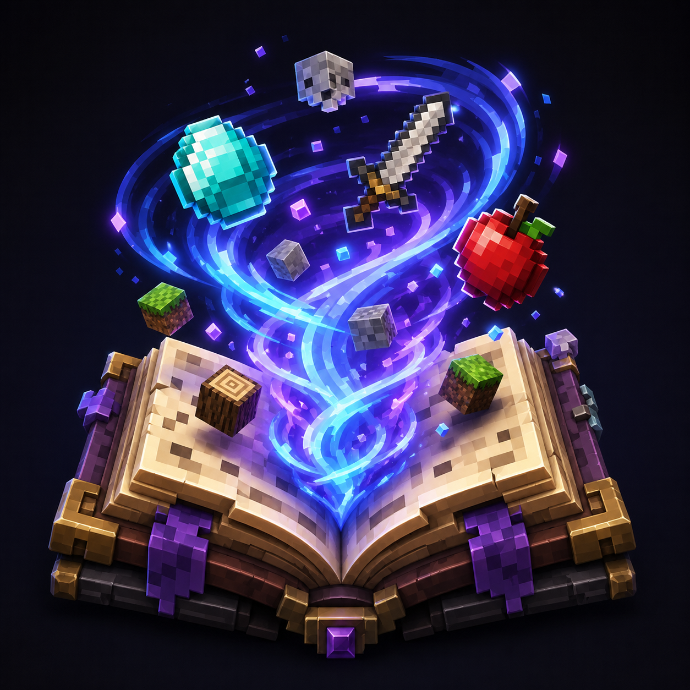

# R3CT Collector's Book 📚

A powerful, highly configurable completionist mod for Minecraft.
Gather items, complete categories, compete on the server leaderboard, and unlock custom rewards. Built natively for both Fabric and NeoForge!

  

---

## ✨ Features

* **📚 The Ultimate Catalog:** * Automatically scans your game and mods to build a dynamic collection book based on Creative Tabs.
    * Submit items directly from your inventory to permanently unlock them in your catalog.
    * Smart filtering system ensuring only obtainable items are required.

  

* **🎁 Milestones & Rewards:** * Earn XP for every unique item you submit.
    * Receive randomized loot drops for hitting major milestones (e.g., every 100 items).
    * Claim exclusive, customizable rewards for reaching 100% completion in specific categories.

* **👑 Server Leaderboard:** * Integrated real-time leaderboard showing the Top 10 collectors on the server.
    * Hover over players to see their exact completion percentage for every category!

  

* **⭐ Custom Advancements:** * Features a full advancement tree to announce your major milestones to the server, culminating in the ultimate "Catch 'Em All!" challenge for 100% game completion.

* **🖥️ Beautiful GUI:** * Fully interactive, scalable, and modern book interface (Default key: `C`).

* **🔄 Cross-Platform:** * Fully native support and identical features for both **Fabric** and **NeoForge**.

---

## 🔌 Dependencies & Requirements

To run this mod, you will need to install a few library mods depending on your loader:

**For Fabric:**
* [Fabric API](https://modrinth.com/mod/fabric-api) (Required)
* [Mod Menu](https://modrinth.com/mod/modmenu) (Optional - to access in-game settings)

**For NeoForge:**
* Nothing!

---

## 📖 Documentation

For detailed guides on how to configure blacklists, customize rewards, and manage player data, visit our official Wiki:
👉 **[View the Wiki](https://github.com/R3CTrc/R3CT-Collector/wiki)**

<b>Click to see popular topics 💡</b>

* [📥 Getting Started](https://github.com/R3CTrc/R3CT-Collector/wiki/Getting-Started)
* [⚙️ Blacklisting Items & Mods](https://github.com/R3CTrc/R3CT-Collector/wiki/Blacklists)
* [🎁 Customizing Rewards & Milestones](https://github.com/R3CTrc/R3CT-Collector/wiki/Custom-Rewards)
* [💾 Managing Player Data](https://github.com/R3CTrc/R3CT-Collector/wiki/Data-Management)

---

## ⚙️ Configuration & Customization

The mod is highly customizable! There are two ways to configure the mod:

### 1. In-Game Settings (Client-side)
Players can access the mod settings via **Mod Menu** (on Fabric) or the **Mods tab** (on NeoForge). Here, users can adjust the GUI scale to perfectly fit their monitor resolution.

### 2. File Configuration (Server-side / Modpack Creators)
All core rules, blacklists, and rewards can be easily modified. After running the mod once, navigate to the `config/r3ct_collector/` folder:

* **`r3ct_collector_items.json`** - Manage blacklisted specific items, entire mods, or whole creative tabs to balance your modpack.
* **`r3ct_collector_rewards.json`** - Customize how much XP players get per item, define milestone loot pools (with drop weights), and set specific rewards for completing categories.

---

## 📥 Installation

1. Download the latest release from the **Versions** tab.
2. Download the required dependencies listed above for your specific mod loader.
3. Place all `.jar` files into your Minecraft `mods` folder.
4. Launch the game and start collecting!

---

## 💖 Support the Development

I'm a computer science student, and I develop game mods and software in my free time. If my work has improved your server or modpack, consider supporting my coding journey! Every coffee helps me survive late-night debugging sessions. ☕💻

### 🌟 Memberships & Perks
Want to get more involved? Check out my Ko-fi memberships for exclusive perks:
* 🥉 **Iron Supporter:** Behind-the-scenes previews and a special Discord role.
* 🥈 **Gold Supporter:** Voting power for new features and priority issue reviews.
* 🥇 **Diamond Supporter:** Name in the Hall of Fame and custom feature requests!

[Join a Tier and support the mod!](https://ko-fi.com/r3ct_/tiers)

---

## 📄 License
This project is available under the [MIT License](LICENSE). Feel free to learn from the code and include it in your modpacks!